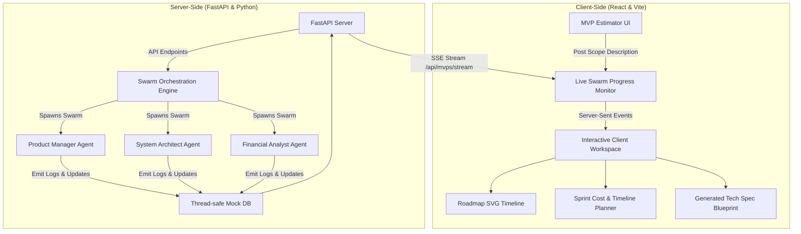

# Aegis MVP Launchpad 🚀

Aegis MVP Launchpad is an enterprise-grade client portal and AI agent swarm scope estimator built to showcase top-tier engineering quality, visual excellence, and DevOps practices for an elite **MVP Development Service**.

This repository demonstrates how a modern MVP development agency operates: bridging the gap between client ideas and structured technical delivery. Clients use the portal to define their MVP ideas, run a collaborative agent swarm analysis, map out their visual roadmap, plan budgets, and monitor sprint updates in real-time.

---

## 🏗️ Architectural Overview

Aegis is designed around clean architectural separation, with a fully asynchronous event-driven backend and a highly polished, responsive Single Page Application (SPA) frontend.



### Key Engineering Practices Demonstrated:
* **Clean Layered Architecture (Python)**: Clear demarcation of API routers, domain logic (agent swarm and estimators), schemas (Pydantic), and database storage.
* **Server-Sent Events (SSE)**: Asynchronous real-time log and state streaming from backend agents to client dashboard without HTTP polling.
* **SVG Graph Visualization**: Responsive SVG DAG mapping the MVP workflow phases (Ideation, Design, Development, QA, Launch) with active step indicator glows.
* **Reactive Calculation State**: Real-time frontend recalculations of team size, delivery date, and sprints as users adjust scope priorities or timeline velocity.
* **DevOps Excellence**: Dual-service containerization via Docker and Docker Compose, linting standards, and backend unit testing via pytest.

---

## 🛠️ Tech Stack & Tooling

### Backend
* **Python 3.11+**
* **FastAPI**: Fast, asynchronous web framework.
* **Pydantic v2**: High-performance data validation.
* **Pytest**: Unit testing and assertions.

### Frontend
* **React 18** with **TypeScript**
* **Vite**: Ultra-fast build tool and bundler.
* **Tailwind CSS**: Contemporary styling system.
* **Lucide Icons**: Clean, scalable iconography.

### DevOps
* **Docker & Docker Compose**
* **GitHub Actions**: Continuous integration workflow.

---

## 🚀 Getting Started

### Prerequisites
Make sure you have [Docker](https://www.docker.com/) and [Docker Compose](https://docs.docker.com/compose/) installed on your machine.

### Quick Start with Docker
1. Clone the repository and navigate to the project root:
   ```bash
   cd mvp-development
   ```
2. Build and start the services:
   ```bash
   docker-compose up --build
   ```
3. Open your browser and navigate to:
   * **Client Dashboard**: [http://localhost:5173](http://localhost:5173)
   * **API Swagger Documentation**: [http://localhost:8000/docs](http://localhost:8000/docs)

### Local Development (Without Docker)

#### Running the Backend
1. Navigate to the `backend/` directory:
   ```bash
   cd backend
   ```
2. Create and activate a virtual environment:
   ```bash
   python -m venv venv
   source venv/bin/activate
   ```
3. Install dependencies:
   ```bash
   pip install -r requirements.txt
   ```
4. Run the FastAPI development server:
   ```bash
   uvicorn app.main:app --reload --port 8000
   ```

#### Running the Frontend
1. Navigate to the `frontend/` directory:
   ```bash
   cd ../frontend
   ```
2. Install dependencies:
   ```bash
   npm install
   ```
3. Run the Vite development server:
   ```bash
   npm run dev
   ```

---

## 🧪 Testing

We value high test coverage and solid software contract assertions.

### Run Backend Tests
Navigate to the `backend/` directory and run pytest:
```bash
pytest
```

---

## 📊 Core Features Showcase

### 1. The AI Scope Swarm
A client enters their raw product text. The backend spins up three concurrent virtual agents to collaborate on the specification:
* **Product Manager**: Synthesizes details into tangible user stories (Backlog items).
* **System Architect**: Designs database tables, key APIs, tech stack, and structure.
* **Financial Analyst**: Evaluates development sprint complexity, sizes team, and calculates budget.

### 2. Live Collaboration Monitor
The client watches the planning session unfold. As agents log thoughts and produce blueprints, Server-Sent Events stream details directly into the UI logs and timeline cards.

### 3. SVG Project Roadmap
A beautiful visual representation of the stages to MVP launch. Completed stages display with checkmarks, active stages glow with animations, and pending stages stay blurred.

### 4. Interactive Sprint Planner
Clients can drag feature scopes, toggle priority levels, or speed up the delivery timeline with a slider. Costs, sprints, and launch date estimates recalculate instantly in the browser.

---

## ⚖️ License
Distributed under the MIT License. See `LICENSE` for details.
