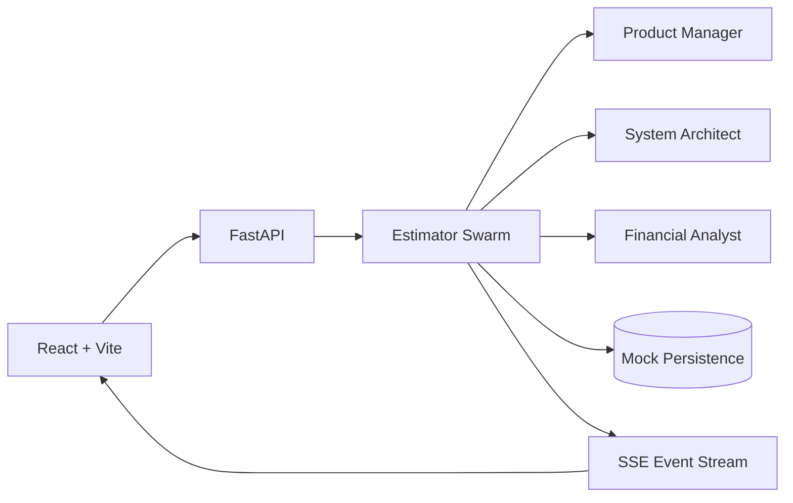

# Aegis MVP Launchpad 🚀

> A client-facing MVP scoping and estimation workspace powered by a deterministic agent-swarm planning flow.

Aegis turns an initial product description into a structured backlog, technical blueprint, delivery timeline, and budget estimate, while streaming planning progress to the browser.

## Architecture



## Core capabilities

| Area | Capability |
| --- | --- |
| Scoping | Project intake with bounded description, platforms, and target timeline |
| Agent planning | Product, architecture, and finance estimation stages |
| Live updates | Server-Sent Events for progress/log streaming |
| Planning | User stories, technical endpoints, database schemas |
| Estimation | Hours, team size, hourly rate, timeline, milestone breakdown |
| Client workspace | Roadmap, sprint planner, and technical specification views |
| API | FastAPI + Pydantic validation |
| Frontend | React 18 + TypeScript + Vite + Tailwind |
| Delivery | Docker Compose + GitHub Actions |
| Safety baseline | CORS allowlist, API-key hook, bounded inputs, bounded SSE queues, log caps |

## Repository structure

```text
.
├── backend/
│   ├── app/
│   │   ├── api/          # HTTP + SSE routes
│   │   ├── core/         # swarm/configuration primitives
│   │   ├── db/           # MVP persistence abstraction
│   │   └── schemas/      # Pydantic contracts
│   ├── tests/
│   ├── Dockerfile
│   └── requirements.txt
├── frontend/
│   ├── src/
│   │   ├── components/   # workspace UI
│   │   └── types/
│   ├── package.json
│   └── vite.config.ts
├── docker-compose.yml
├── SECURITY.md
└── CONTRIBUTING.md
```

## Quick start

### Docker

From the repository root:

```bash
docker compose up --build
```

Then open:

- Frontend: http://localhost:5173
- API docs: http://localhost:8000/docs
- Health: http://localhost:8000/api/health

### Local development

Backend:

```bash
cd backend
python -m venv .venv
source .venv/bin/activate
pip install -r requirements.txt
pip install -r requirements-dev.txt
uvicorn app.main:app --reload --port 8000
```

Frontend:

```bash
cd frontend
npm ci
npm run dev
```

## Configuration

Use the root `.env.example` as the starting point.

Important settings:

```text
APP_ENV=development
CORS_ALLOWED_ORIGINS=http://localhost:5173
AEGIS_API_KEY=
MAX_DESCRIPTION_LENGTH=20000
MAX_PROJECT_LOGS=250
PORT=8000
```

When `AEGIS_API_KEY` is configured, API routes require the same value in the `X-API-Key` header.

For production, add real authentication/authorization and per-user project access controls. The included API-key hook is intentionally a simple deployment baseline, not a complete identity system.

## API

Main endpoints:

```text
GET    /api/health
GET    /api/mvps
POST   /api/mvps
GET    /api/mvps/{project_id}
GET    /api/mvps/{project_id}/stream
PATCH  /api/mvps/{project_id}/backlog
```

The estimation flow is asynchronous from the client's perspective: project creation returns a processing record, the swarm updates state in the background, and the browser can consume progress over SSE.

## Quality checks

Backend:

```bash
cd backend
ruff check .
black --check .
pytest -q
```

Frontend:

```bash
cd frontend
npm ci
npm run build
```

GitHub Actions executes backend compilation/lint/tests, frontend build, and a Python dependency audit.

## Product behavior

The current implementation is a **planning/estimation MVP**. The swarm uses deterministic heuristics to generate example backlog, architecture, and financial outputs from the submitted product description. Replace those deterministic stages with real model-backed agents only behind explicit provider, authorization, evaluation, and cost controls.

## Security and production readiness

Read [SECURITY.md](SECURITY.md) before deployment.

This repository is not a certified compliance product. A production tenant-facing deployment should additionally implement:

- authenticated identity and authorization
- per-user/project data isolation
- durable database storage
- rate limiting and abuse protection
- secrets management
- audit logging
- encrypted transport
- model/provider data-handling controls
- operational monitoring and backup/recovery

## Contributing

See [CONTRIBUTING.md](CONTRIBUTING.md).

## License

MIT — see [LICENSE](LICENSE).
